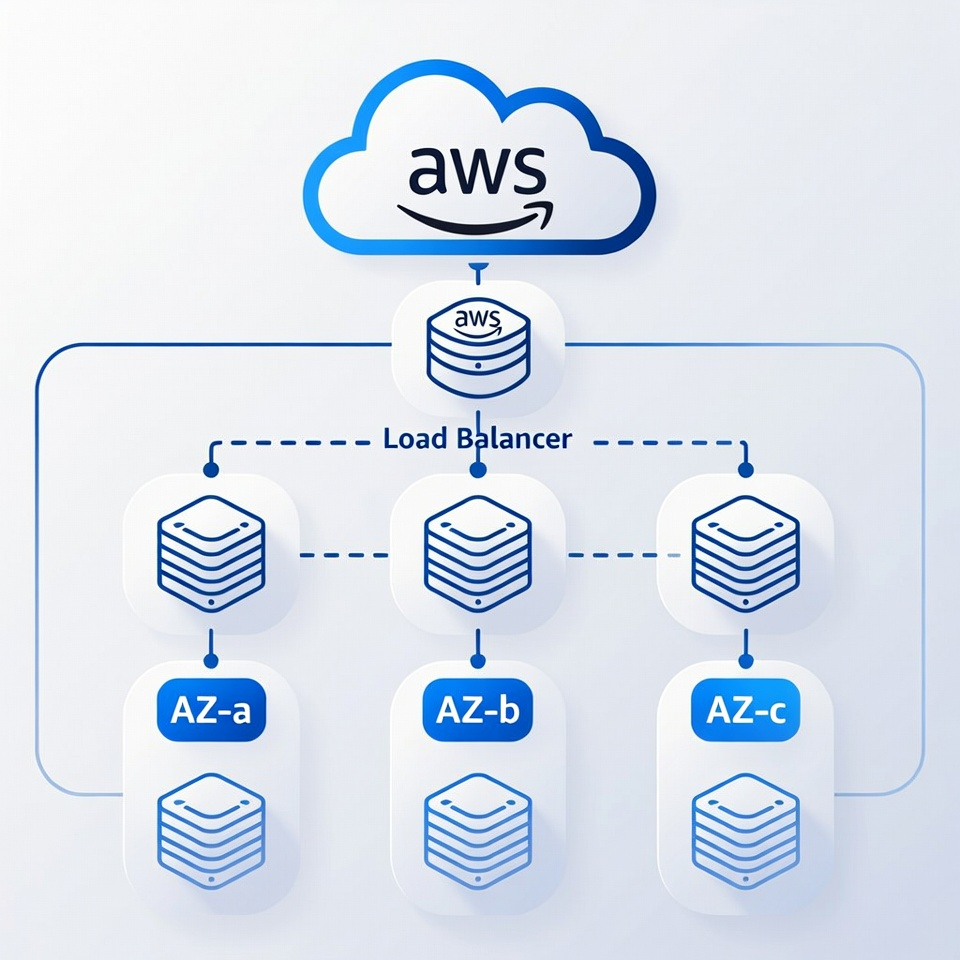

# ☁️ AWS Weekly Terraform Assignments (Summary)


This repository contains a series of **modular AWS Terraform assignments** designed to progressively build a secure, scalable, and production-ready cloud environment.  
Each **branch** represents a weekly milestone, beginning with core authentication and backend state configuration, then expanding into VPC architecture, subnets, gateways, routing, NAT services, and security layers.

Over time, the assignments assemble a complete **AWS network foundation** capable of supporting compute workloads, load balancers, autoscaling, monitoring, SNS alerting, and S3 static website deployments—fully managed through Infrastructure as Code.

---

## 📊 Architecture Diagram



---

## 📌 Branch Breakdown

### 🔹 [`assignment-10142025`](https://github.com/tiqsclass6/aws-repo-assignments/tree/assignment-10142025)

- **Focus:** Initial AWS environment bootstrap
- **Includes:**
  - Terraform authentication setup (`0-authentication.tf`)
  - VPC creation (`1-vpc.tf`)
  - Subnet definitions (`2-subnets.tf`)
  - Remote backend configuration (`A-backend.tf`)

---

### 🔹 [`assignment-10212025`](https://github.com/tiqsclass6/aws-repo-assignments/tree/assignment-10212025)

- **Focus:** Networking expansion and routing logic
- **Includes:**
  - `.gitignore` for Terraform and state exclusions
  - Internet Gateway (`3-igw.tf`)
  - NAT Gateway (`4-nat.tf`)
  - Route Tables and associations (`5-rtb.tf`)
  - Complete VPC foundation for hybrid and public workloads

---

### 🔹 [`assignment-10282025`](https://github.com/tiqsclass6/aws-repo-assignments/tree/assignment-10282025)

- **Focus:** Advanced Route Table Expansion + Multi-AZ Public/Private Routing  
- **Includes:**
  - `6-SG-All.tf` — Defines all project Security Groups, including ingress/egress rules for EC2, ALB, SSH, and application traffic  
  - `7-instances.tf` — Creates a standard EC2 instance for testing network reachability, SG behavior, and future ALB/ASG integration  
- **Outcome:**  
  This branch extends the network layer by adding Security Groups and initial EC2 resources, ensuring the project has **secured routing, controlled traffic paths, and testable compute infrastructure** for the next stages.

---

### 🔹 [`assignment-11042025`](https://github.com/tiqsclass6/aws-repo-assignments/tree/assignment-11042025)

- **Focus:** Security hardening + IAM role expansion  
- **Includes:**
  - `B. outputs.tf` — Adds outputs for Target Group ARNs and related identifiers, enabling downstream consumption by the Load Balancer and Autoscaling branches  
- **Outcome:**  
  This branch introduces foundational **output exports** used by later compute components, ensuring that Target Groups and other load-balancing resources are easily consumable and referenceable throughout the infrastructure.

---

### 🔹 [`assignment-11112025`](https://github.com/tiqsclass6/aws-repo-assignments/tree/assignment-11112025)

- **Focus:** Compute preparation + key management  
- **Includes:**
  - `8-target-groups.tf` — Creates ALB Target Groups for routing traffic to EC2 instances or autoscaling groups  
  - `9-load-balancer.tf` — Provisions an Application Load Balancer (ALB), listeners, and listener rules  
  - `10-autoscaling-policy.tf` — Defines scaling policies (CPU, request count, step scaling, predictive scaling) for dynamic capacity management  
  - `11-launch-template.tf` — Configures an AWS Launch Template with AMI, instance type, SGs, user data, and tagging for ASG usage  
- **Outcome:**  
  This branch introduces the **core Compute Layer**, enabling scalable EC2 infrastructure behind an ALB—with key components such as Target Groups, Launch Templates, and Autoscaling Policies fully implemented.

---

### 🔹 [`assignment-11182025`](https://github.com/tiqsclass6/aws-repo-assignments/tree/assignment-11182025)

- **Focus:** Monitoring + Alerting + Observability
- **Includes:**
  - `venezuela.sh` — Custom Apache script that caters for Venezuela.
- **Outcome:**
Establishes the Monitoring & Alerting Layer, providing real-time visibility, proactive notifications, and scaling behaviors driven by production-grade metrics.

---

### 🔹 [`assignment-11252025`](https://github.com/tiqsclass6/aws-repo-assignments/tree/assignment-11252025)

- **Focus:** Simple Notification Service (SNS) Integration  
- **Includes:**
  - `12-sns.tf` — Configures SNS topics, subscriptions, and IAM roles for alerting DevOps teams.
- **Outcome:**  
  This branch adds **notification capabilities** to the monitoring setup, enabling automated alerts via SNS for critical infrastructure events and thresholds. It also enhances the observability framework established in the previous branch.

---

### 🔹 [`assignment-12022025`](https://github.com/tiqsclass6/aws-repo-assignments/tree/assignment-12022025)

- **Focus:** Static Website Hosting + S3 Deployment Using Terraform  
- **Includes:**
  - `0-auth.tf` — Authentication + AWS IAM credentials configuration  
  - `1-providers.tf` — AWS provider setup and global Terraform settings  
  - `2-s3.tf` — S3 bucket creation, website hosting configuration, and public access settings  
  - `3-outputs.tf` — Exposes S3 website endpoint and bucket details  
  - `A-index.html` — Main Argentina-themed animated landing page  
  - `B-wifey.html` — Secondary HTML content page (linked in website or used as error page)

- **Outcome:**  
  This branch delivers a **fully functional static website** hosted on an AWS S3 bucket using Terraform.  
  It includes all Terraform IaC components required to build and deploy the site, plus two custom HTML pages styled and animated for the Argentina-themed project.

---

### 🔹 [`assignment-12092025`](https://github.com/tiqsclass6/aws-repo-assignments/tree/assignment-12092025)

- **Focus:** Secure Static Website Delivery w/CloudFront & S3 (Terraform)

- **Files & Descriptions:**
  - `0-authentication.tf` – Terraform backend configuration and state management
  - `1-providers.tf` – AWS provider configuration, including region and provider aliases
  - `2-variables.tf` – Input variables defining project naming and configuration values
  - `3-s3.tf` – Private S3 bucket configuration, versioning, public access blocking, and static website objects
  - `4-cloudfront.tf` – CloudFront distribution, Origin Access Control (OAC), TLS configuration, custom error responses, and automated cache invalidation logic
  - `5-waf.tf` – AWS WAF Web ACL configuration and association with CloudFront for core security protections
  - `6-outputs.tf` – Exported outputs including CloudFront distribution details
  - `index.html` – Primary static website entry point
  - `error.html` – Custom error page served by CloudFront
  - `Screenshots/` – Deployment evidence, including CloudFront, S3, Terraform workflow, and validation screenshots
  - `website-demo.mp4` – End-to-end video demonstration of the deployed website

- **Outcome:**  
  A production-ready, security-focused static website architecture demonstrating CDN delivery, private origin access, HTTPS enforcement, WAF protections, custom error handling, and infrastructure automation using Terraform.

---

### 🔹 [`assignment-12162025`](https://github.com/tiqsclass6/aws-repo-assignments/tree/assignment-12162025)

- **Focus:** High-Availability Global Web System with Auto Scaling, Application Load Balancer, and Route 53 (Terraform)

- **Files & Descriptions:**
  - `13-key.tf` – SSH key pair management
  - `14-route53.tf` – Route 53 hosted zone and record aliasing
  - `hungary.sh` – User data script for Hungary-themed web content
  - `japan.sh` – User data script for Japan-themed web content

- **Outcome:**  
  A resilient, scalable web application infrastructure incorporating auto scaling, load balancing, DNS management, and notification systems, demonstrating high availability and automated resource management in AWS using Terraform.

---

### 🔹 [`assignment-12232025`](https://github.com/tiqsclass6/aws-repo-assignments/tree/assignment-12232025)

- **Focus:** Multi-Region VPC Peering Architecture with EC2 Web Servers (Terraform)

- **Files & Descriptions:**
  - `.gitignore` – Git ignore configuration file
  - `0-authentication.tf` – AWS provider and authentication configuration
  - `1-vpc.tf` – Multi-region VPC provisioning
  - `2-subnets.tf` – Public and private subnets across regions
  - `3-igw.tf` – Internet Gateways for regional VPCs
  - `4-rtb.tf` – Route tables with peering routes
  - `5-sg.tf` – Security groups for EC2 instances
  - `6-instances.tf` – EC2 web server deployments in multiple regions
  - `7-backend.tf` – Terraform state management backend
  - `8-output.tf` – Resource output definitions
  - `japan.sh` – User data script for Japan-themed Apache web server setup
  - `README.md` – Detailed documentation including architecture diagram, deployment steps, prerequisites, and troubleshooting
  - `Screenshots/` – Directory with evidence of VPC peering connections, EC2 instances, route tables, and related resources

- **Outcome:**  
  A secure, multi-region AWS infrastructure facilitating private inter-VPC communication through peering connections, with regionally deployed web servers, emphasizing modular Terraform code, networking best practices, and cross-region connectivity without public internet exposure.

---

## 🗂️ Repository Tree

```plaintext
assignment-10142025/
├── .gitignore
├── 0-authentication.tf
├── 1-vpc.tf
├── 2-subnets.tf
├── A-backend.tf
|
assignment-10212025/
├── 3-igw.tf
├── 4-nat.tf
├── 5-rtb.tf
|
assignment-10282025/
├── 6-SG-All.tf
├── 7-instances.tf
|
assignment-11042025/
├── B-outputs.tf
|
assignment-11112025/
├── 8-target-groups.tf
├── 9-load-balancer.tf
├── 10-autoscaling-policy.tf
├── 11-launch-template.tf
|
assignment-11182025/
├── venezuela.sh
|
assignment-11252025/
├── 12-sns.tf
|
assignment-12022025/
├── 0-auth.tf
├── 1-providers.tf
├── 2-s3.tf
├── 3-outputs.tf
├── A-index.html
├── B-wifey.html
|
assignment-12092025/
├── 0-authentication.tf
├── 1-providers.tf
├── 2-variables.tf
├── 3-s3.tf
├── 4-cloudfront.tf
├── 5-waf.tf
├── 6-outputs.tf
├── index.html
├── error.html
├── Screenshots/
└── website-demo.mp4
|
assignment-12162025/
├── 13-key.tf
├── 14-route53.tf
├── hungary.sh
├── japan.sh
|
assignment-12232025/
├── 0-authentication.tf
├── 1-vpc.tf
├── 2-subnets.tf
├── 3-igw.tf
├── 4-rtb.tf
├── 5-sg.tf
├── 6-instances.tf
├── 7-backend.tf
├── 8-output.tf
```

---

## 🚀 Getting Started

```bash
git clone https://github.com/tiqsclass6/aws-repo-assignments
cd aws-repo-assignments
git checkout <branch-name>
terraform init
terraform fmt -recursive
terraform validate
terraform plan
terraform apply -auto-approve
```

> [!NOTE]
> Replace `<branch-name>` with one of the branch names above.

---

## 🧰 Tools Used

- **Terraform** – Primary Infrastructure as Code (IaC) tool used to provision, manage, and automate all AWS resources in a declarative, repeatable, and version-controlled manner.
- **Amazon Web Services (AWS)** – Cloud platform hosting core services, including VPC, EC2, S3, CloudFront, Application Load Balancer (ALB), Route 53, WAF, ACM, SNS, and IAM.
- **Amazon Virtual Private Cloud (VPC)** – Isolated networking environment with customizable subnets, route tables, Internet Gateways, and NAT Gateways for secure resource isolation.
- **Amazon EC2** – Compute service providing scalable virtual servers for hosting web applications with user data scripts for automated configuration.
- **Amazon S3** – Object storage for static website assets, Terraform state management (backend), and bucket-based remote state locking.
- **Amazon CloudFront** – Global content delivery network (CDN) for low-latency, secure distribution of static content with HTTPS enforcement and caching.
- **AWS Application Load Balancer (ALB)** – Layer 7 load balancing for distributing traffic across EC2 instances with health checks and HTTPS listeners.
- **Auto Scaling Group (ASG)** – Automated scaling of EC2 instances based on policies, integrated with launch templates for consistent deployments.
- **Amazon Route 53** – Scalable DNS service for domain routing, hosted zones, and alias records pointing to ALB or CloudFront distributions.
- **Origin Access Control (OAC)** – CloudFront security feature restricting S3 bucket access exclusively through the distribution.
- **AWS Certificate Manager (ACM)** – Provisioning and management of TLS/SSL certificates for secure HTTPS communication in CloudFront and ALB.
- **AWS WAF (Web Application Firewall)** – Managed security rules protecting web applications from common exploits, associated with CloudFront or ALB.
- **Amazon Simple Notification Service (SNS)** – Pub/Sub messaging for sending notifications on scaling events and alerts.
- **AWS Shield Standard** – Built-in DDoS protection for CloudFront and other resources at no additional cost.
- **VPC Peering** – Private connectivity mechanism enabling secure communication between VPCs across regions without public internet exposure.
- **Terraform Remote Backend** – S3 and DynamoDB integration for centralized state storage, versioning, and collaborative locking.
- **Terraform `terraform_data` Resource** – Orchestration tool for triggering post-deployment actions, such as CloudFront cache invalidations.
- **AWS CLI** – Command-line interface for resource verification, invalidation commands, and troubleshooting deployments.
- **Bash Scripts (User Data)** – Automation scripts (e.g., `japan.sh`, `hungary.sh`) for initializing Apache web servers and deploying themed content on EC2 instances.
- **GitHub Version Control** – Repository management with branch-based assignments tracking incremental infrastructure development.
- **GitHub Branching Workflow** – Structured branching model for progressive enhancements in networking, security, compute, and distribution.
- **Markdown Documentation** – Comprehensive README files, architecture overviews, deployment guides, and troubleshooting sections.
- **Shields.io Badges** – Dynamic visual badges indicating tools, security features, automation status, and project milestones.
- **HTML/CSS** – Static website content with custom themes served via S3/CloudFront or dynamic EC2-hosted pages.

---

## ⚙️ Learning Progression

|Week|Branch|Focus|Key Files|
|---|---|---|---|
|1️⃣|`assignment-10142025`|Base VPC + Auth + Backend|`0-authentication.tf`, `1-vpc.tf`, `2-subnets.tf`, `A-backend.tf`|
|2️⃣|`assignment-10212025`|IGW + NAT + Basic Routing|`3-igw.tf`, `4-nat.tf`, `5-rtb.tf`|
|3️⃣|`assignment-10282025`|Security Groups + EC2 Instance|`6-SG-All.tf`, `7-instances.tf`|
|4️⃣|`assignment-11042025`|Security + IAM Expansion|`B-outputs.tf`|
|5️⃣|`assignment-11112025`|Compute + Load Balancer + Autoscaling|`8-target-groups.tf`, `9-load-balancer.tf`, `10-autoscale-policy.tf`, `11-launch-template.tf`|
|6️⃣|`assignment-11182025`|Monitoring + Alerting Script|`venezuela.sh`|
|7️⃣|`assignment-11252025`|AWS SNS Notifications|`12-sns.tf`|
|8️⃣|`assignment-12022025`|Full S3 Website Deployment + HTML Content|`0-auth.tf`, `1-providers.tf`, `2-s3.tf`, `3-outputs.tf`, `A-index.html`, `B-wifey.html`|
|9️⃣|`assignment-12092025`|CloudFront + WAF + Secure S3 Hosting|`0-authentication.tf`, `1-providers.tf`, `2-variables.tf`, `3-s3.tf`, `4-cloudfront.tf`, `5-waf.tf`, `6-outputs.tf`, `index.html`, `error.html`|
|🔟|`assignment-12162025`|High-Availability Global Web System with Auto Scaling, ALB, and Route 53|`13-key.tf`, `14-route53.tf`, `hungary.sh`, `japan.sh`|
|1️⃣1️⃣|`assignment-12232025`|Multi-Region VPC Peering Architecture with EC2 Web Servers|`0-authentication.tf`, `1-vpc.tf`, `4-rtb.tf`, `5-sg.tf`, `6-instances.tf`, `japan.sh`|

> [!NOTE]
> Future branches will add compute, IAM roles, and monitoring components.
---

## 🔎 Troubleshooting

| Issue | Possible Fix |
| ------- | -------------- |
| **`terraform init` fails** | Verify Terraform version (`>= 1.6`), provider constraints, and backend configuration. If using a remote backend, ensure the S3 bucket and DynamoDB lock table exist with valid credentials. Run `terraform init -upgrade` if providers need updating. |
| **AWS credential errors** | Ensure `AWS_ACCESS_KEY_ID` and `AWS_SECRET_ACCESS_KEY` are configured via environment variables, AWS CLI, or an IAM role. Run `aws sts get-caller-identity` to verify access. |
| **ACM certificate not found** | CloudFront certificates **must** exist in `us-east-1`. Verify the certificate status is **ISSUED** and the correct domain name is referenced. |
| **CloudFront distribution stuck in Deploying** | CloudFront updates are global and may take several minutes. Wait for status to change to **Deployed** before testing. |
| **CloudFront returns 403 Access Denied** | Confirm Origin Access Control (OAC) is configured and the S3 bucket policy allows `s3:GetObject` from the CloudFront distribution ARN. |
| **Custom error page not loading** | Ensure `error.html` exists at the **bucket root** and that both **403 and 404** custom error responses are configured in CloudFront. |
| **WAF not attaching to CloudFront** | WAF Web ACLs for CloudFront must be created in `us-east-1`. Verify the `web_acl_id` is set on the distribution. |
| **CloudFront cache not updating after content changes** | Verify the `terraform_data` invalidation resource is triggering correctly and that the AWS CLI is installed and authenticated. |
| **CloudFront invalidation fails** | Ensure correct path formatting (`"/*"`), valid distribution ID, and sufficient IAM permissions for `cloudfront:CreateInvalidation`. |
| **S3 objects not uploading** | Confirm file paths are correct and that `for_each` object definitions reference valid source files. Check `terraform plan` for file diffs. |
| **Website loads over HTTP instead of HTTPS** | Verify CloudFront viewer protocol policy is set to `redirect-to-https` and the ACM certificate is correctly attached. For ALB-based setups, ensure the HTTPS listener is configured and the certificate is validated in the correct region. |
| **WAF blocking legitimate traffic** | Review WAF sampled requests and metrics in CloudWatch. Adjust or exclude managed rule sets if necessary. |
| **Terraform state lock issues** | If using a remote backend, ensure no stale locks exist in DynamoDB. Retry after a few minutes or manually clear locks if required. |
| **ALB returns 503 errors** | Verify instances pass health checks, target group port matches the application (e.g., 80 for HTTP), and instance security groups allow traffic from the ALB security group. |
| **Route 53 alias not resolving correctly** | Confirm the A record alias points to the correct ALB DNS name and region. Check for certificate validation issues affecting HTTPS. |
| **VPC peering connection inactive or routing failures** | Ensure the peering connection is active, route tables in both VPCs include peering routes, and security groups/network ACLs permit the desired traffic. Validate non-overlapping CIDR blocks. |
| **Resource creation failures** | Review AWS service quotas, CloudTrail logs for errors, and validate resource configurations (e.g., CIDR ranges). |

---

## 🤝 Contributing

**Stored in the [CONTRIBUTING.md](CONTRIBUTING.md) file**

1. Fork the repository  
2. Create a feature branch — `git checkout -b feature/new-feature`  
3. Commit changes — `git commit -m "Add new feature"`  
4. Push branch — `git push origin feature/new-feature`  
5. Submit a Pull Request 🎯

---

## 📜 License

This project is licensed under the **MIT License**.  
See the [LICENSE](LICENSE.txt) file for details.

---

## 👨‍💻 Author & Acknowledgments

- **Author:** T.I.Q.S.
- **Group Leader:** John Sweeney

---
