# 🌐 Secure Static Website Delivery w/CloudFront & S3 (Terraform)


---

## 📌 Project Overview

This project demonstrates a secure, cost-optimized, production-ready static website delivery architecture using **Amazon CloudFront, Amazon S3, and AWS WAF**, fully deployed and managed with Terraform.

It follows modern AWS best practices including private S3 origins with **Origin Access Control (OAC), HTTPS enforcement with TLS 1.3, AWS WAF core protections, and automated CloudFront cache invalidation** on content changes.

---

## 🎯 Project Tasks & Requirements

- **Private S3 bucket for static content**
- **Secure delivery through CloudFront**
- **TLS 1.3 via ACM**
- **AWS WAF core protections enabled**
- **Custom error pages**
- **Automatic CloudFront invalidation**
- **Infrastructure as Code (Terraform)**
- **Free-tier / cost-optimized configuration**

---

## 🏗️ Architecture Overview


---

## 📁 Project Structure

```plaintext
assignment-12092025/
├── Screenshots/                                    # Screenshots and Demo Media
│   ├── cloudfront-distribution-pt1.jpg
│   ├── cloudfront-distribution-pt2.jpg
│   ├── cloudfront-distribution-pt3.jpg
│   ├── cloudfront-s3-website.jpg
│   ├── s3-bucket-pt1.jpg
│   ├── s3-bucket-pt2.jpg
│   ├── s3-bucket-pt3.jpg
│   ├── s3-bucket-pt4.jpg
│   ├── s3-bucket-pt5.jpg
│   ├── terraform-init-fmt-validate.jpg
│   ├── terraform-plan.jpg
│   ├── terraform-apply.jpg
│   └── terraform-destroy.jpg
│   └── website-demo.mp4
│
├── .gitignore                                      # Ignore files for Git
├── 0-authentication.tf                             # AWS Provider and Authentication
├── 1-providers.tf                                  # Terraform Providers
├── 2-variables.tf                                  # Input Variables
├── 3-s3.tf                                         # S3 Bucket Configuration
├── 4-cloudfront.tf                                 # CloudFront Distribution Configuration
├── 5-waf.tf                                        # AWS WAF Configuration
├── 6-outputs.tf                                    # Output Values
├── error.html                                      # Custom Error Page
├── index.html                                      # Sample Static Website Content
└── README.md                                       # Project Documentation
```

---

## 🚀 Deployment Steps

```bash
terraform init
terraform fmt -recursive
terraform validate
terraform plan
terraform apply -auto-approve
```

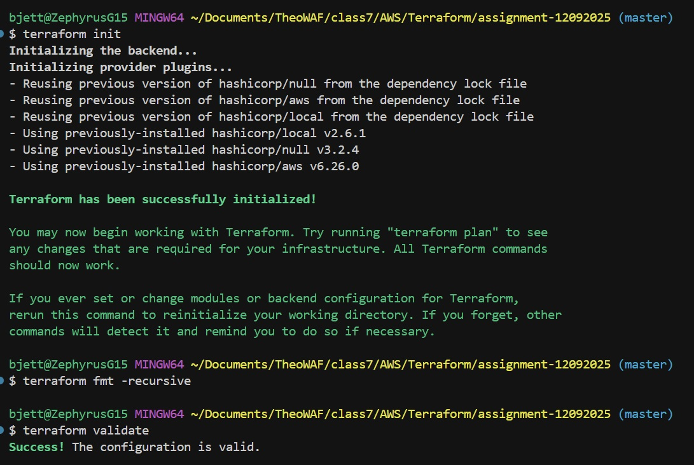
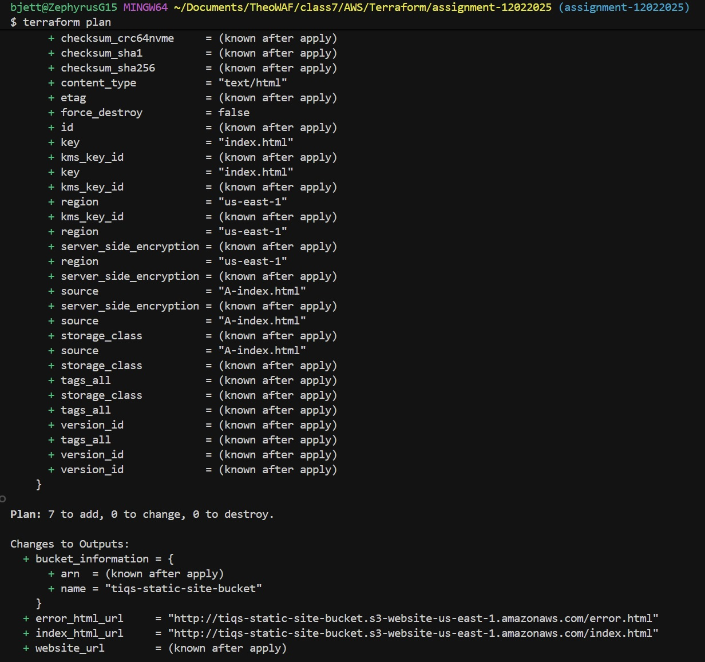
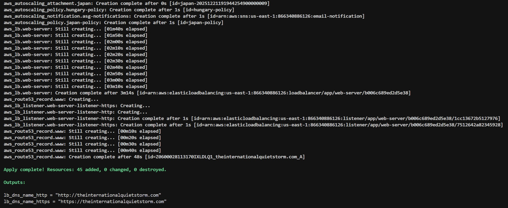

---

## 🌍 Website and Demo

- **Website URL:** Retrieved from Terraform outputs after deployment.
  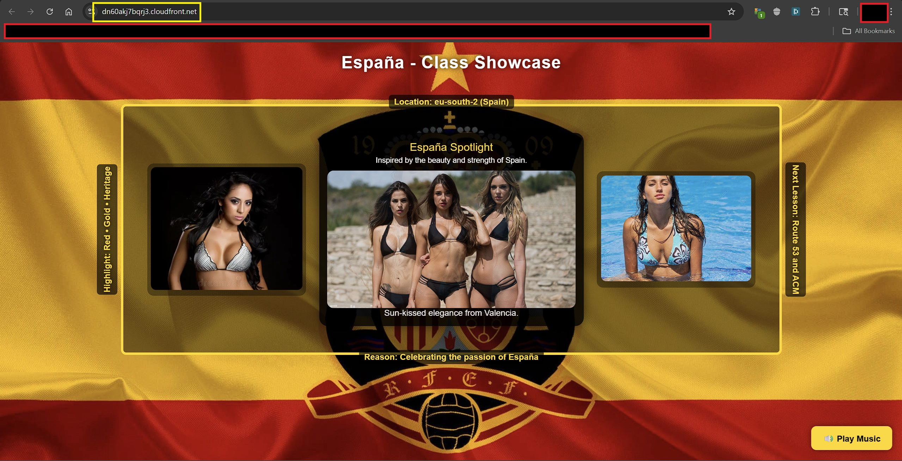

- **Demo Video:**

   https://github.com/user-attachments/assets/562446bb-dd83-461d-9a34-e0b83aedfdca

---

## 📸 Screenshots

### S3 Bucket Configuration

- 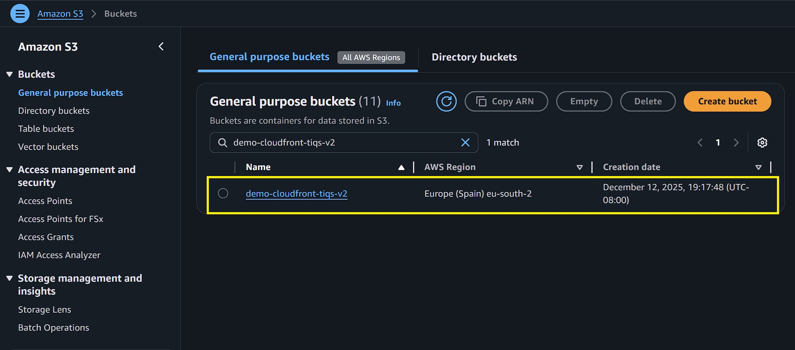
- 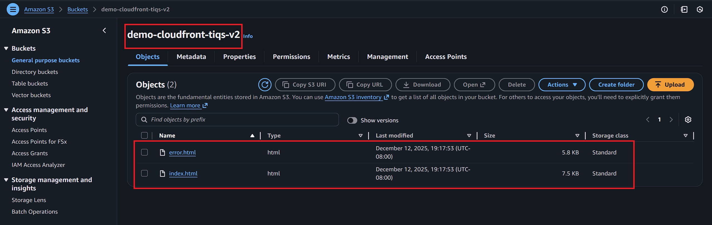
- 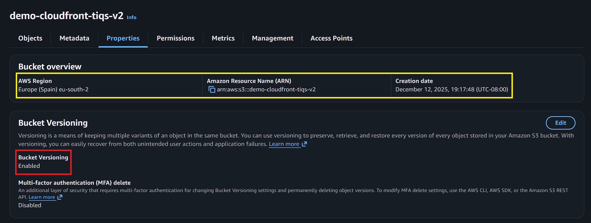
- 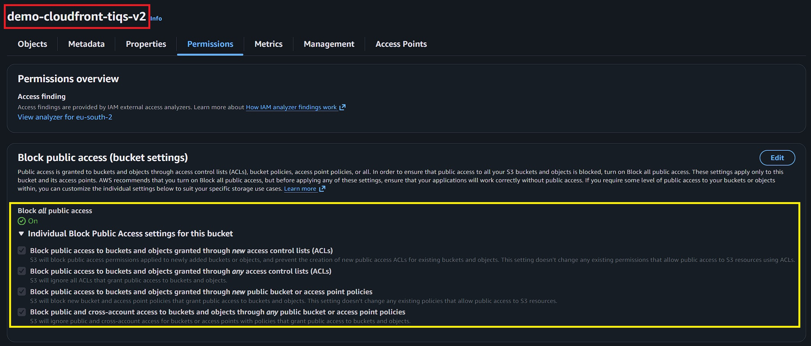
- 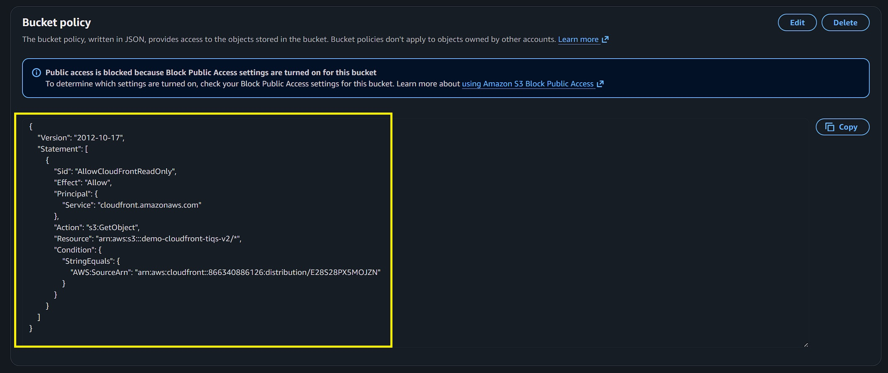

### CloudFront Distribution Configuration

- 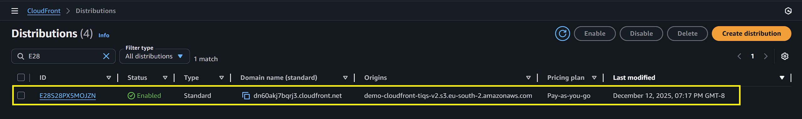
- 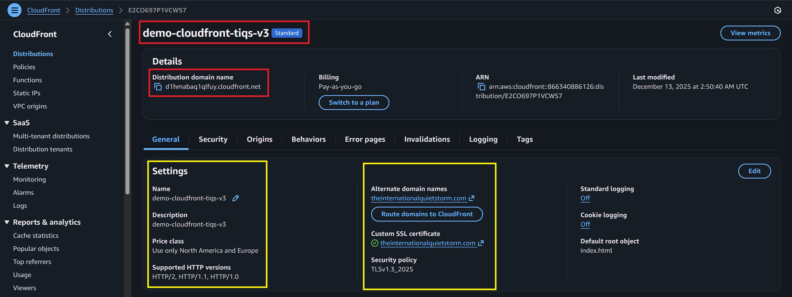
- 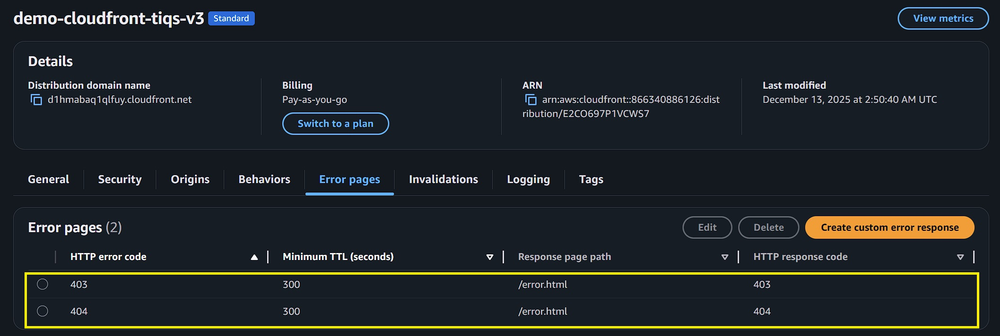

---

## 🧹 Teardown

```bash
terraform destroy -auto-approve
```

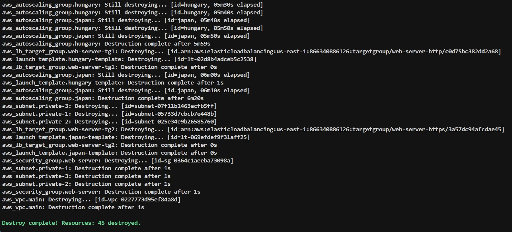

---

## 🛠️ Troubleshooting

- Ensure ACM cert is in `us-east-1`
- WAF for CloudFront must be created in `us-east-1`
- Use proper quoting for invalidations `("/*")`

---

## 📚 References

1. **HashiCorp Terraform – AWS Provider Documentation**  
   Official documentation for the AWS provider used to provision and manage AWS resources with Terraform, including CloudFront, S3, WAF, and IAM.  
   <https://registry.terraform.io/providers/hashicorp/aws/latest>

2. **Amazon CloudFront – Developer Guide**  
   Comprehensive guide covering CloudFront distributions, origins, security features (TLS, Origin Access Control), caching behaviors, and performance optimization.  
   <https://docs.aws.amazon.com/cloudfront/>

3. **AWS WAF – Developer Guide**  
   Official documentation for AWS Web Application Firewall, including managed rule groups, core protections, monitoring, and CloudFront integration.  
   <https://docs.aws.amazon.com/waf/>

4. **Terraform Language Documentation**  
   Official reference for Terraform language syntax, resource lifecycle, expressions, and advanced features such as `for_each`, `locals`, and `terraform_data`.  
   <https://developer.hashicorp.com/terraform/language>

5. **AWS Well-Architected Framework – Security Pillar**  
   Guidance on designing and operating secure, reliable, and compliant cloud architectures, aligned with AWS best practices.  
   <https://docs.aws.amazon.com/wellarchitected/latest/security-pillar/>

6. **AWS Shield Standard – Overview**  
   Overview of AWS Shield Standard, which provides automatic DDoS protection for CloudFront distributions at no additional cost.  
   <https://docs.aws.amazon.com/shield/latest/standard/>

---

## ✍️ Authors

- **Author:** T.I.Q.S.
- **Group Leader:** John Sweeney

---
